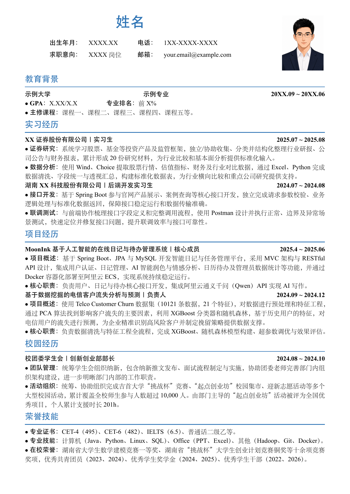

# 中文求职简历 LaTeX 模板

## 文件介绍

这是中文求职简历 LaTeX 模板，使用 XeLaTeX 编译，适合展示教育背景、实习经历、项目经历、校园经历与荣誉技能等信息。

可以用于以下场景：

1. 校园招聘。
2. 实习申请。
3. 日常求职简历投递。
4. 如需考研复试简历，可参考配套的 [中文考研复试简历模板](https://github.com/kodyyu1126/Chinese-resume-template-postgraduate)。

本简历默认推荐在 macOS 本地使用华文宋体、华文黑体、华文楷体和 Times New Roman 编译，以获得最佳显示效果。仓库不提供华文字体文件；在 Overleaf 等其他环境中，如需接近 macOS 本地效果，可自行将已授权的字体文件上传至 `fonts/` 文件夹。

## 文件结构

```text
Chinese-resume-template-work/
├── assets/
│   ├── profile-photo.png                # 简历头像（自行替换）
│   └── resume-preview.png               # 简历预览图
├── fonts/                               # 可自行上传字体文件
├── work-resume.tex                       # 简历源文件
├── work-resume.pdf                       # 编译后的示例 PDF
├── .gitignore
├── LICENSE
└── README.md
```

## 使用步骤

### Overleaf

1. GitHub -> **Code -> Download ZIP**。
2. [Overleaf](https://www.overleaf.com/) -> **New Project -> Upload Project**。
3. 打开 `work-resume.tex`，将 Compiler 设为 **XeLaTeX**。
4. 如需使用自定义字体，将字体文件上传至 `fonts/` 文件夹；根据注释完成个人信息、经历和头像的编辑。

### VS Code （推荐）

1. 下载并解压项目，用 VS Code 打开整个文件夹。
2. 安装 LaTeX 发行版和 [LaTeX Workshop](https://marketplace.visualstudio.com/items?itemName=James-Yu.latex-workshop) 扩展。
3. 通过 LaTeX Workshop 使用 **XeLaTeX** 编译。
4. 根据注释完成个人信息、经历和头像的编辑。

## 示例截图

[查看示例 PDF](./work-resume.pdf)



## 致谢

感谢 [Adobe 思源字体](https://github.com/adobe-fonts/source-han-serif) 和 [Google Noto CJK](https://github.com/notofonts/noto-cjk) 提供的开源字体支持。

## License

This project is licensed under the MIT License. See [LICENSE](./LICENSE) for details.

## 联系方式

- Email: [kodyyu1126@outlook.com](mailto:kodyyu1126@outlook.com)
- QQ: `2386157328`
